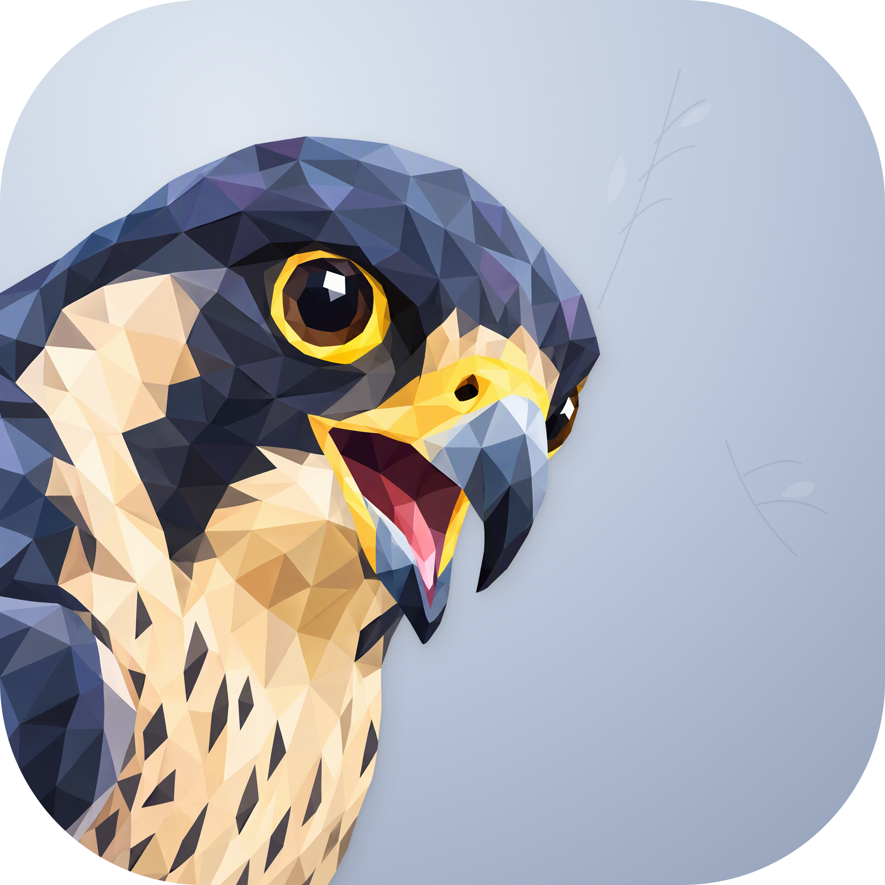

# Falcon



**让本机 Agent 的 Jev 决策看得见。**

Falcon 是 macOS 原生 Jev HTTP / MCP 代理与七天决策观察应用。每个来源使用独立本地 key，可以映射同一个或不同的上游。SwiftUI、AppKit、Swift Charts 与 Swift 服务运行在同一进程中。

宽幅工作区同时展示 state、定义、问题、选项和决策；支持来源图标、来源与时间筛选、全文检索、一键 triage、备注、真实阶段回放、延迟与 token 统计、JSON / CSV 导出。普通记录保留七天，加星记录永久保留完整证据，每次新请求仍然调用 Jev。

## 运行

需要 macOS 15+、Xcode 与 XcodeGen。当前验证工具链为 Xcode 27 / Swift 6.4；运行时不依赖 Python 或 Node。

```sh
scripts/build-app.sh Release
open build/Build/Products/Release/Falcon.app
```

脚本默认构建本机架构，产物位于 `build/Build/Products/Release/Falcon.app`。这是本地开发构建。

正式安装包见 [GitHub Releases](https://github.com/nocoo/falcon/releases)。v0.1.1 提供 macOS 15+ 的 Apple Silicon / Intel 通用 DMG，采用 Apple Development 签名，未经过 Apple 公证。下载 DMG 和同名 `.sha256` 后，在下载目录执行：

```sh
shasum -a 256 -c Falcon-0.1.1-universal.dmg.sha256
```

打开 DMG，将 Falcon 拖入 Applications。若确认下载可信且校验通过，但 macOS 因未公证阻止打开，可仅移除 Falcon 的下载隔离属性：

```sh
xattr -dr com.apple.quarantine /Applications/Falcon.app
open /Applications/Falcon.app
```

此命令不会完成公证，也不能修复损坏的签名。签名及标准发版步骤见 [AGENTS.md](AGENTS.md#standard-macos-release-procedure)。

版本只在 [project.yml](project.yml) 的 `MARKETING_VERSION` 中维护；侧栏、设置、关于面板和服务元信息读取同一构建版本。界面使用 `vX.Y.Z`，HTTP `/health` 与 MCP `serverInfo.version` 返回 `X.Y.Z`。变更记录见 [CHANGELOG.md](CHANGELOG.md)。

1. 首次真实启动自动进入 **Connections**，保存 Jev key、HTTPS API root 和默认模型。官方 root 是 `https://api.typesafe.ai`。
2. 在 **Sources** 创建来源、选择 connection 和图标，复制仅显示一次的本地 key。图标默认 Unknown，可选择 Codex、Grok、Claude Code 等；点击现有来源图标即可编辑。
3. 将 Agent 的 API root 指向 `http://127.0.0.1:19823`，Bearer token 使用该来源的本地 key。
4. 发起决策后，在 **Decisions** 回看；**Focus review** 可收起导航与列表，**Usage** 可点击图表钻取。

关闭窗口后服务继续在菜单栏运行。Quit 退出应用；登录启动默认关闭。修改端口后需同步更新客户端配置。

无需上游凭据即可查看合成数据：

```sh
open build/Build/Products/Release/Falcon.app --args --preview --dark
```

Preview 使用独立临时数据库，不监听端口、不读取真实凭据文件、不调用上游。退出后校验测试 marker 并清理。正常启动不加 `--preview`，只显示真实历史；没有请求时列表为空。

## 接入

HTTP 兼容 TypeSafe 官方 SDK 的 `/v1/systemone` 路径。以下示例从环境变量读取已经配置的来源 key：

```sh
curl http://127.0.0.1:19823/v1/systemone \
  -H "Authorization: Bearer $FALCON_SOURCE_KEY" \
  -H "Content-Type: application/json" \
  -d '{"model":"jev-latest","state":"Review an isolated change","questions":{"execution":{"type":"choice","instructions":"Choose how to proceed.","criteria":{"local":"Enough context for a bounded task.","inspect":"Important evidence is missing."}}}}'
```

MCP 使用 Streamable HTTP、JSON response 和 `jev_decide` 工具；客户端须支持固定 Authorization header：

```json
{
  "mcpServers": {
    "falcon": {
      "url": "http://127.0.0.1:19823/mcp",
      "headers": {"Authorization": "Bearer YOUR_SOURCE_KEY"}
    }
  }
}
```

上游 key 明文保存在 `~/.config/falcon/credentials.json`，文件由 Connections 自动维护，目录权限 `0700`、文件权限 `0600`，采用原子写入。应用不使用 Keychain。本地来源 key 只持久化摘要。未加星的请求和响应在本机保留 168 小时；加星后永久保留，可从列表的星标入口查看全部时间。超过七天的记录取消星标会删除，操作前确认；设置中的清空历史也包含星标。数据默认明文存储于当前用户的 Application Support/Falcon，导出文件由用户管理。回放不会再次请求 Jev，也不表示 Agent 已执行了决策。

详情底部的 **Review & next**（⌘Return）保存当前备注、标记已阅并打开下一条未阅。旗标和备注独立操作；详情工具栏的星标（⇧⌘S）及列表右键菜单控制永久留存。来源图标的出处与许可见 [harness assets](assets/harness/README.md)，菜单栏符号见 [brand assets](assets/brand/README.md)。

## 开发验证

```sh
export DEVELOPER_DIR=/Applications/Xcode.app/Contents/Developer
swift test --enable-code-coverage
scripts/check-sdk.sh
swiftlint lint --strict
xcrun swift-format lint --strict --recursive Sources Tests
git diff --check
```

测试使用临时 SQLite、内存或隔离文件凭据与真实 loopback fixture。SDK 检查通过 `uv` 运行锁定的官方 `typesafe-sdk==0.7.1`，只在开发期使用。默认 Swift 测试不执行该 opt-in Python 用例。

完整四项覆盖率与自动提交门禁尚未达标；生产 Jev、完整无障碍矩阵和大数据性能仍有验证边界。已执行证据与预算见 [交付与验证](docs/05-delivery.md)。

## 文档

[设计目录](docs/README.md) · [架构与数据](docs/02-architecture.md) · [HTTP / MCP 契约](docs/03-protocol.md) · [界面设计](docs/04-interface.md) · [回看与回放](docs/08-review-playback.md) · [独立设计审阅](docs/07-design-review.md)

Agent 项目约束见 [AGENTS.md](AGENTS.md)，事故记录见 [Retrospective.md](Retrospective.md)。
